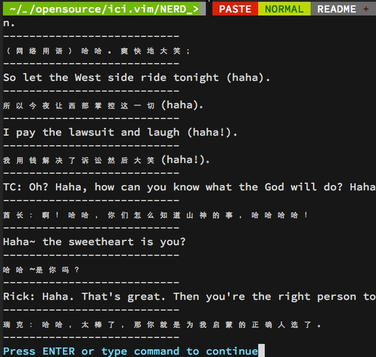

# ici.vim 基于python的vim查词插件

## Install

* 将ici.vim 拷贝到~/.vim/plugin/文件夹下即可

* 支持BundleInstall

	.vimrc 添加Bundle 'Flowerowl/ici.vim'

	:BundleInstall
	
* 终端版ici: https://github.com/Flowerowl/ici.vim

## How to Use

* :Ici word

* :IciFrom
	
	选中某个单词, :IciFrom即可查询 

### 注意

windows上需要自行编译vim的python支持

